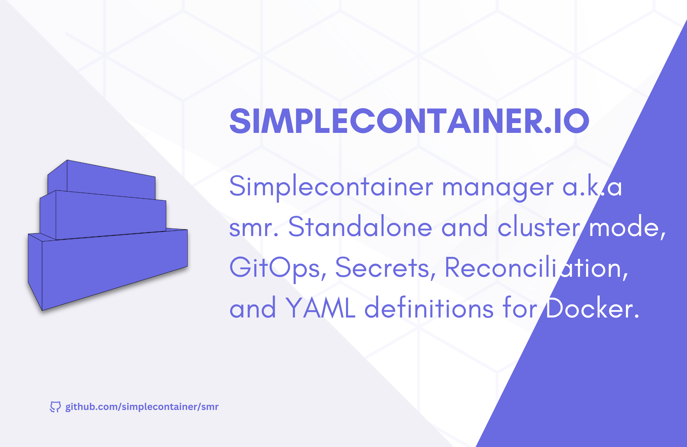

# Simplecontainer client
> [!IMPORTANT]
> The project is not stable yet. Releases and major changes are introduced often.

Simplecontainer is based on the server-client architecture. You can interact with the remote/local client via mTLS.

## Installation
--------------------------
### Using smrmgr
The smrmgr is bash script for management of the simplecontainer. It is used for:
- Downloading and installing client
- Starting the node in single or cluster mode
- Starting the node and joining to the existing cluster
- Various options and configuration simplified

```bash
curl -sL https://raw.githubusercontent.com/simplecontainer/smr/refs/heads/main/scripts/production/smrmgr.sh -o smrmgr
chmod +x smrmgr
sudo mv smrmgr /usr/local/bin
sudo smrmgr install
```

### Using smr
The smr is client used to communicate to the local/external simplecontainer agents running on nodes.
The smrmgr automatically downloads the client and places it under `/usr/local/bin/smr`.

To manually install, start and manage simplecontainer nodes download the client from the releases:

https://github.com/simplecontainer/client/releases

```bash
LATEST_VERSION=$(curl -s https://raw.githubusercontent.com/simplecontainer/client/main/version)
PLATFORM=linux-amd64
curl -o client https://github.com/simplecontainer/client/releases/download/$VERSION/client-$PLATFORM
sudo mv client /usr/local/bin/smr
```

Explore `/scripts/production/smrmgr.sh` to see how you can utilize smr client to configure and start simplecontainer nodes.


### Install smr in the pipeline agents
```bash
LATEST_VERSION=$(curl -s https://raw.githubusercontent.com/simplecontainer/client/main/version)
PLATFORM=linux-amd64
curl -o client https://github.com/simplecontainer/client/releases/download/$VERSION/client-$PLATFORM
sudo mv client smr
echo "$PWD" >> $PATH
```

# License
This project is licensed under the GNU General Public License v3.0. See more in LICENSE file.