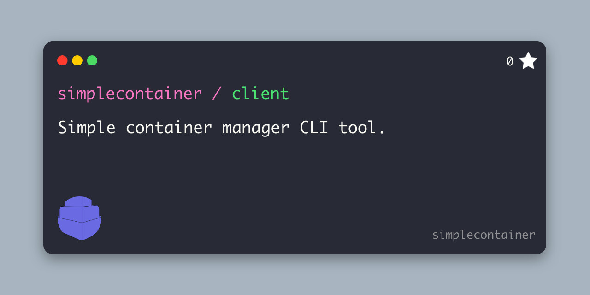

# Simplecontainer client
> [!WARNING]
> The project is not stable yet. Use it on your own responsibility.

Simplecontainer is based on the server-client architecture. You can interact with the remote/local client via mTLS.

## Installation
--------------------------
### (Bash) smrmgr
The smrmgr is bash script for management of the simplecontainer. It is used for:
- Downloading and installing client
- Starting the node in single or cluster mode
- Starting the node and joining to the existing cluster
- Various options and configuration simplified

```bash
curl -sL https://raw.githubusercontent.com/simplecontainer/smr/refs/heads/main/scripts/production/smrmgr.sh -o smrmgr
chmod +x smrmgr
sudo mv smrmgr /usr/local/bin
sudo smrmgr install

smr context connect https://localhost:1443 $HOME/.ssh/simplecontainer/root.pem --context localhost
{"level":"info","ts":1720694421.2032707,"caller":"context/Connect.go:40","msg":"authenticated against the smr-agent"}
smr ps
GROUP  NAME  DOCKER NAME  IMAGE  IP  PORTS  DEPS  DOCKER STATE  SMR STATE
```
### (CLI) smr
Client CLI is binary actually used for control plane communication  to the simplecontainer over the network using mTLS.
It is secured by mutual verification and encryption.

To install client just download it from releases:

https://github.com/simplecontainer/client/releases

Example for installing latest version manually:

```bash
export VERSION=$(curl -sL https://raw.githubusercontent.com/simplecontainer/client/main/version)
export PLATFORM=linux-amd64
curl -Lo smr https://github.com/simplecontainer/client/releases/download/$VERSION/client-$PLATFORM
chmod +x smr
sudo mv smr /usr/local/bin/smr
smr context connect https://localhost:1443 $HOME/.ssh/simplecontainer/root.pem --context localhost
{"level":"info","ts":1720694421.2032707,"caller":"context/Connect.go:40","msg":"authenticated against the smr-agent"}
smr ps
GROUP  NAME  DOCKER NAME  IMAGE  IP  PORTS  DEPS  DOCKER STATE  SMR STATE
```
Afterward, access to the control plane of the simplecontainer is configured.
# License
This project is licensed under the GNU General Public License v3.0. See more in LICENSE file.